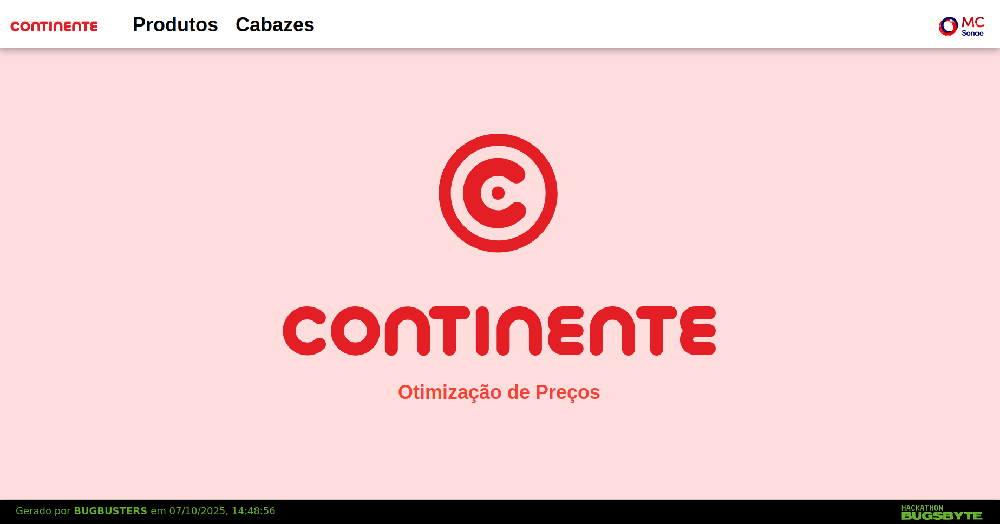
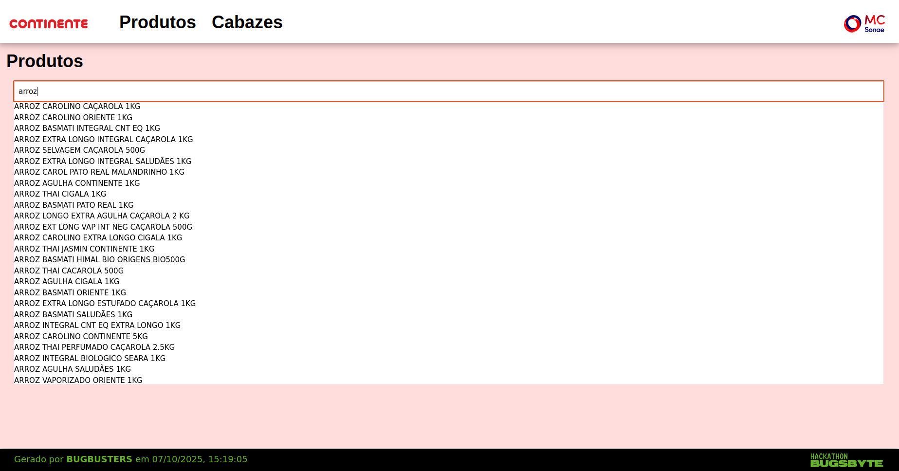
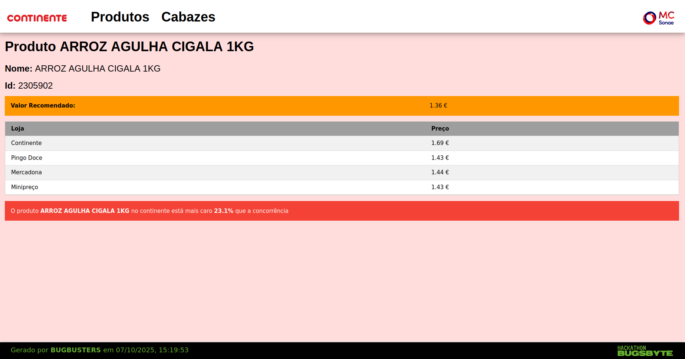
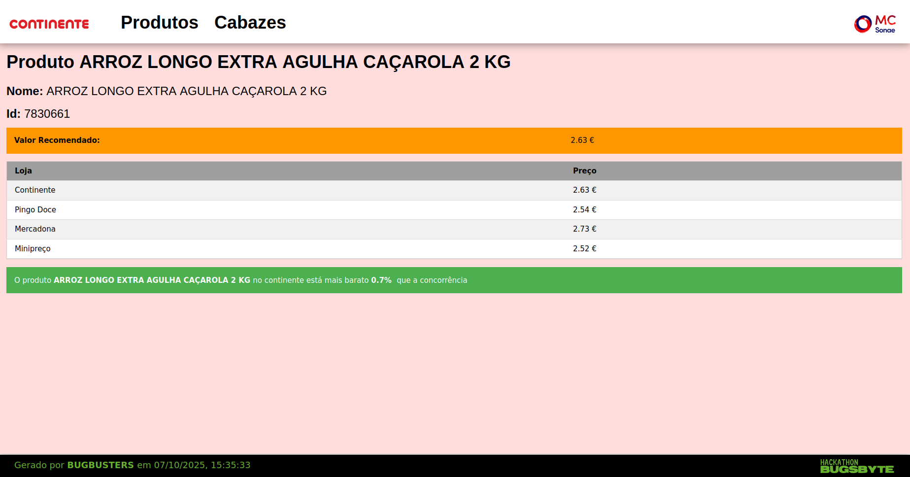
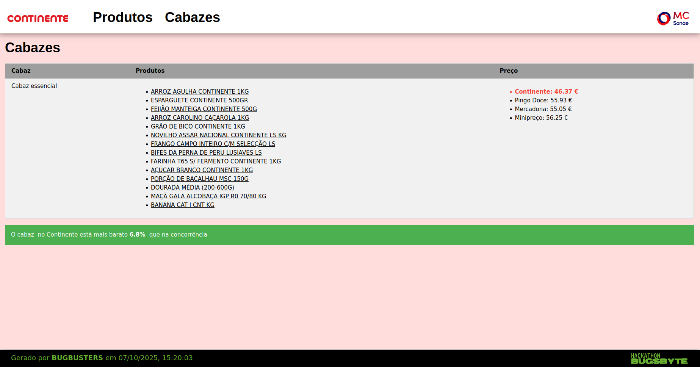

# Price Optimizer 💲
## Projeto feito na HACKATHON BUGSBYTE 2025 🪲
Uma **aplicação web** que permite pesquisar um **produto do Continente** e fornece o preço deste, a variação em relação ao mercado, o preço noutros supermercados, e um preço recomendado para este produto. A aplicação também permite ver o preço de um **cabaz típico**, e a variação deste em relação ao mercado. Utilizamos **web scraping** para obter **dados reais dos preços do Continente** e o dataset fornecido para saber o índice de preço.

### Tema da MC SONAE - Ferramenta de otimização de preços 💲


## Como correr?
### Requisitos:
- Node.js instalado
- json-server instalado

### Comandos:
```
git clone git@github.com:a104437ana/HACKATHON-BUGSBYTE-2025.git
```
```
cd HACKATHON-BUGSBYTE-2025
```
#### Abrir 3 terminais:

##### Terminal 1

No primeiro terminal correr o json-server:
```
json-server Dados/data.json --watch
```

##### Terminal 2

No segundo terminal correr a API de dados:
```
cd API_de_dados
```
```
npm i
```
```
npm start
```

##### Terminal 3

No terceiro terminal correr o Front-end:
```
cd Front-end
```
```
npm i
```
```
npm start
```

#### Por fim, explorar a aplicação web: http://localhost:3002/

## Projeto desenvolvido
### Página Inicial

### Página dos Produtos

### Página do Produto ARROZ AGULHA CIGALA 1KG

### Página do Produto ARROZ LONGO EXTRA AGULHA CAÇAROLA 2 KG

### Página dos Cabazes


## Equipa BUGBUSTERS 🪲
- [Ana Sá Oliveira](https://github.com/a104437ana)
- Inês Silva Marques
- José Rafael de Oliveira Vilas Boas

